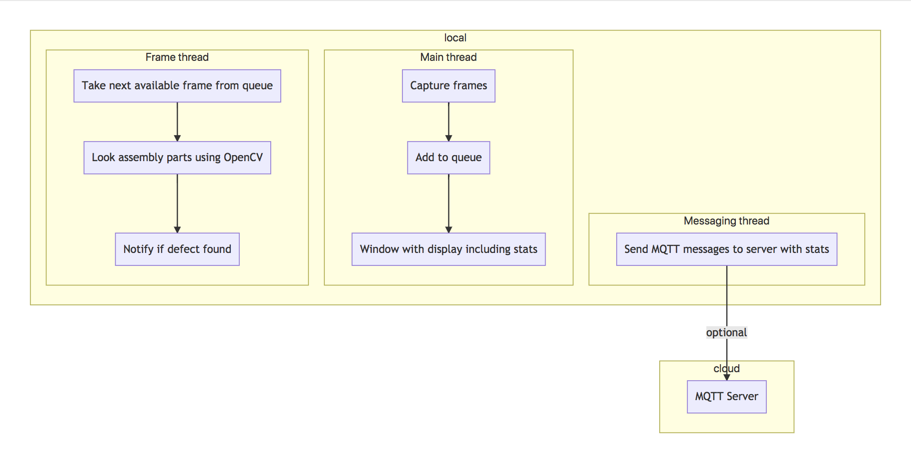

# Object Size Detector

| Details            |              |
|-----------------------|---------------|
| Target OS:            |  Ubuntu\* 16.04 LTS   |
| Programming Language: |  C++\* |
| Time to Complete:     |  45 min     |


## Introduction

This object size detector application is one of a series of computer vision (CV) reference implementations using the OpenVINO™ toolkit. This application demonstrates how to use CV to detect and measure the approximate size of assembly line parts. It is designed to work with an assembly line camera mounted above the assembly line belt. The application monitors mechanical parts as they are moving down the assembly line and raises an alert if it detects a part on the belt outside a specified size range.

## Requirements

### Hardware
* 6th Generation Intel® Core™ processor with Intel® Iris® Pro graphics and Intel® HD Graphics

### Software
* [Ubuntu\* 16.04 LTS](http://releases.ubuntu.com/16.04/)
*Note*: NOTE: Use kernel versions 4.14+ with this software. However, kernel versions 4.7+ are also recommended.

Determine the kernel version with the uname command. In a terminal window type on the command line:
```
uname -a
```
* OpenCL™ Runtime Package
* OpenVINO™ toolkit

## How it works

This object size detector works with a video source, such as a camera. The application captures video frames and processes the frame data with OpenCV* algorithms. It detects objects on the assembly line and calculates the area (length x width) the objects occupy. If the calculated area is not within a predefined range, as specified via command line parameters, the application raises an alert to notify the assembly line operator. Optionally, the application sends data to a message queuing telemetry transport (MQTT) machine, or machine messaging server, as part of an assembly line data analytics system.



The program creates three threads for concurrency:

- A main thread that performs the video I/O
- A worker thread that processes video frames using the deep neural networks
- A worker thread that publishes MQTT messages

## Pre-requisites

### Install OpenVINO™ Toolkit
Before running the application, install the OpenVINO™ toolkit. For details, see [Installing the OpenVINO™ toolkit for Linux*](https://software.intel.com/en-us/articles/OpenVINO-Install-Linux)

### Install OpenCL™ Runtime Package

For GPU-based inference, install the OpenCL™ Runtime Package. This step is not necessary for CPU-based inference.

## Setting the build environment

Configure the environment to use the OpenVINO™ toolkit once per session by running the **source** command on the command line:
```
    source /opt/intel/computer_vision_sdk/bin/setupvars.sh
```

## Build the code

Change the current directory to the git-cloned application code location on your system:
```
    cd assembly-line-measurements
```

If a build directory does not exist, create one:
```
    mkdir build
```

Change to the build directory:
```
    cd build
```

The make commands generate the monitor file, the application’s executable. Run the make commands:
```
    cmake ..
    make
```

Once the commands are finished, you should have built the `monitor` application executable.

## Run the code

To see a list of the various options, invoke the help output of this application with the help parameter:
```
    ./monitor -help
```

To run the application with the necessary settings using a webcam, use the min and max parameters:
```
    ./monitor -min=10000 -max=30000
```

The min and max parameters set the values for the minimum and maximum sizes of the part area. If a part’s calculated area in pixels is not within this range, the application issues an alert.

## Sample videos

The reference implementation provides several sample videos to demonstrate the capabilities of this application. 

Download the videos by running this series of commands from the `assembly-line-measurements` directory:
```
    mkdir resources
    cd resources
    wget https://github.com/intel-iot-devkit/sample-videos/raw/master/bolt-detection.mp4
    cd ..
```

To execute the code using one of these sample videos, change directory to the application’s build directory. Run the application from the `assembly-line-measurements` directory with the `-i` input command:
```
    cd build
    ./monitor -min=10000 -max=30000 -i=../resources/bolt-detection.mp4
```

### Machine-to-Machine Messaging with MQTT

To use a MQTT server to publish data, set the `MQTT_SERVER` and `MQTT_CLIENT_ID` environment variables with the export command before running the program:
```
    export MQTT_SERVER=localhost:1883
    export MQTT_CLIENT_ID=cvservice
```

NOTE: Set the `MQTT_SERVER` to the value of the server on your system. Change the `MQTT_CLIENT_ID` to a unique value for each monitoring station to enable tracking data for individual locations.

```
    export MQTT_CLIENT_ID=assemblyline1337
```
