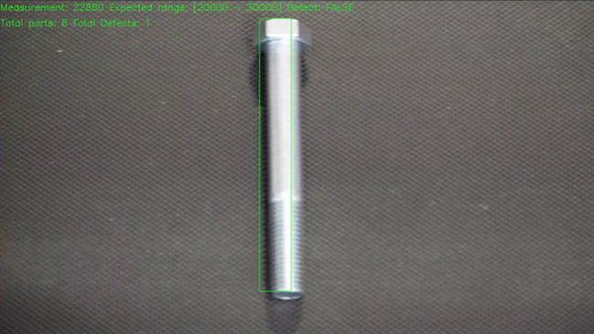
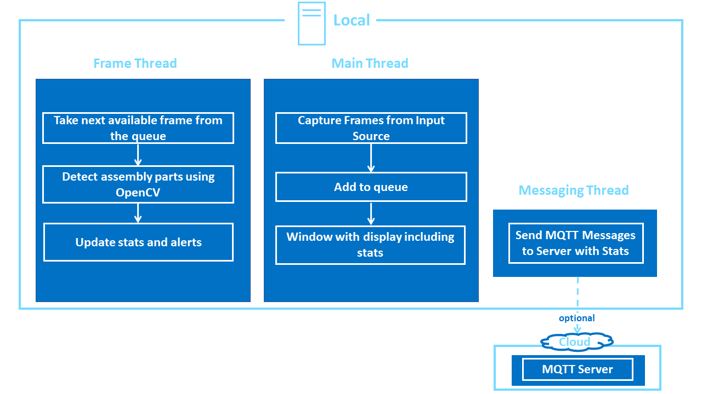

# DISCONTINUATION OF PROJECT #
This project will no longer be maintained by Intel.
Intel has ceased development and contributions including, but not limited to, maintenance, bug fixes, new releases, or updates, to this project.
Intel no longer accepts patches to this project.
# Object Size Detector

| Details            |              |
|-----------------------|---------------|
| Target OS:            |  Ubuntu\* 18.04 LTS   |
| Programming Language: |  C++\* |
| Time to Complete:     |  45 min     |



## What It Does

 This application demonstrates how to use CV to detect and measure the approximate size of assembly line parts. It is designed to work with an assembly line camera mounted above the assembly line belt. The application monitors mechanical parts as they are moving down the assembly line and raises an alert if it detects a part on the belt outside a specified size range.

## Requirements

### Hardware
* 6th to 8th Generation Intel® Core™ processors with Intel® Iris® Pro graphics and Intel® HD Graphics

### Software
* [Ubuntu\* 18.04 LTS](http://releases.ubuntu.com/18.04/)
*Note*: Use kernel versions 4.14+ with this software.

Determine the kernel version with the uname command. In a terminal window type on the command line:
```
uname -a
```
* Intel® Distribution of OpenVINO™ toolkit 2020 R3 Release

## How It Works

This object size detector works with a video source, such as a camera. The application captures video frames and processes the frame data with OpenCV* algorithms. It detects objects on the assembly line and calculates the area (length x width) the objects occupy. If the calculated area is not within a predefined range, as specified via command line parameters, the application raises an alert to notify the assembly line operator. Optionally, the application sends data to a message queuing telemetry transport (MQTT) machine, or machine messaging server, as part of an assembly line data analytics system.



The program creates three threads for concurrency:

- A main thread that performs the video I/O
- A worker thread that processes video frames using the deep neural networks
- A worker thread that publishes MQTT messages

## Setup

### Get the code

Clone the reference implementation
```
sudo apt-get update && sudo apt-get install git
git clone https://github.com/intel-iot-devkit/object-size-detector-cpp.git 
```

### Install OpenVINO

Refer to [Install Intel® Distribution of OpenVINO™ toolkit for Linux*](https://software.intel.com/en-us/articles/OpenVINO-Install-Linux) to learn how to install and configure the toolkit.

### Other dependencies

**Mosquitto**<br>

Mosquitto is an open source message broker that implements the MQTT protocol. The MQTT protocol provides a lightweight method of carrying out messaging using a publish/subscribe model.

### Install the dependencies

To download the sample video and install the dependencies of the application, run the below command in the `object-size-detector-cpp` directory:
```
./setup.sh
```
### The Config File

The _resources/config.json_ contains the path of videos that will be used by the application as input. Each block represents one video file.

For example:
   ```
   {
       "inputs": [
          {
              "video":"path_to_video/video1.mp4"
          }
       ]
   }
   ```

The `path/to/video` is the path to an input video file.

### Which Input Video to use

We recommend using the [bolt-multi-size-detection](https://github.com/intel-iot-devkit/sample-videos/blob/master/bolt-multi-size-detection.mp4) video. For example:

```
{
   "inputs":[
      {
         "video":"sample-videos/bolt-multi-size-detection.mp4"
      }
   ]
}
```

### Using the Camera Stream instead of video

Replace `path/to/video` with the camera ID in the **config.json** file, where the ID is taken from the video device (the number **X** in /dev/video**X**).

On Ubuntu, to list all available video devices use the following command:

```
ls /dev/video*
```

For example, if the output of above command is __/dev/video0__, then config.json would be:

```
  {
     "inputs": [
        {
           "video":"0"
        }
     ]
   }
```


### Setup the Environment

Configure the environment to use the Intel® Distribution of OpenVINO™ toolkit by exporting environment variables:

```
source /opt/intel/openvino/bin/setupvars.sh
```

__Note__: This command needs to be executed only once in the terminal where the application will be executed. If the terminal is closed, the command needs to be executed again.

### Build the Application

To build, go to the `object-size-detector-cpp` and run the following commands:

```
mkdir -p build && cd build
cmake ..
make
```

## Run the Application

To see a list of the various options:
```
./monitor -help
```

To run the application with the necessary settings, use the min and max parameters:
```
./monitor -min=10000 -max=30000
```

The min and max parameters set the values for the minimum and maximum sizes of the part area. If a part’s calculated area in pixels is not within this range, the application issues an alert.

### Machine to Machine Messaging with MQTT

If you wish to use a MQTT server to publish data, you should set the following environment variables before running the program:
```
export MQTT_SERVER=localhost:1883
export MQTT_CLIENT_ID=cvservice
```

Change the `MQTT_SERVER` to a value that matches the MQTT server you are connecting to.

You should change the `MQTT_CLIENT_ID` to a unique value for each monitoring station, so you can track the data for individual locations. For example:

```
export MQTT_CLIENT_ID=assemblyline1337
```

If you want to monitor the MQTT messages sent to your local server, and you have the `mosquitto` client utilities installed, you can run the following command on a new terminal while the application is running:
```
mosquitto_sub -t 'defects/counter'
```
